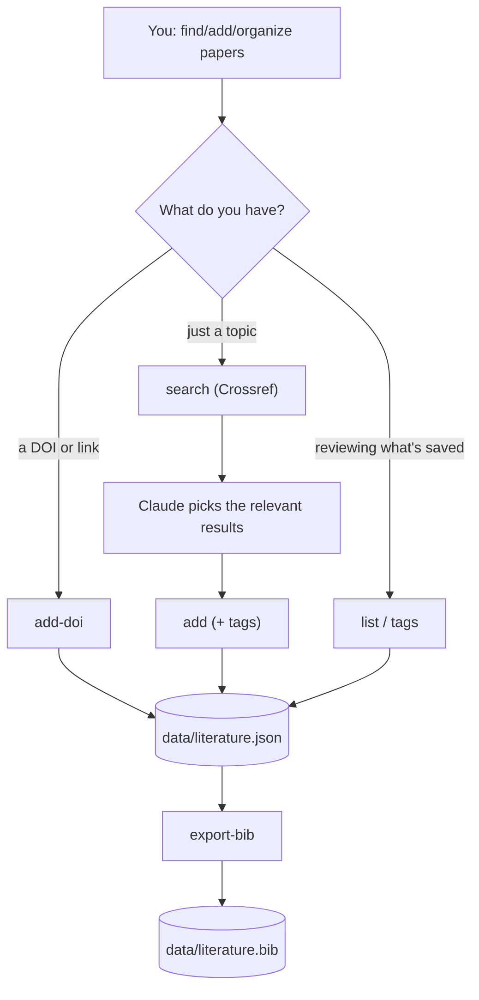

# literature-skill

<p align="center">
  <sub><a href="README.zh-TW.md">繁體中文</a></sub>
</p>

*Search a paper, decide it's relevant, file it, tag it, cite it — without ever hand-editing a .bib file.*

A Claude Code skill that turns literature management into a conversation: ask it to find papers, add the ones that matter to your catalog, filter by topic, and export citations. One JSON file is the single source of truth; BibTeX is always regenerated from it, never edited by hand.

## How it works

- **Search** — queries Crossref, Claude picks what's actually relevant, you confirm before anything is saved.
- **Catalog** — each entry goes into `data/literature.json`, deduplicated by DOI (or title+year). Has a DOI already? `add-doi` fetches the authoritative record directly.
- **Tag** — Claude classifies by content, no fixed taxonomy, reuses existing tags instead of inventing synonyms.
- **Filter** — by tag, year, author, or keyword, any combination.
- **Export** — regenerates `data/literature.bib` from the catalog (optionally filtered), on demand.



## Install

The bundled script only needs the Python standard library, but it runs inside a conda environment named `literature`; the skill creates it on first use if missing (`conda create -n literature python=3.11 -y`). Optionally set `UNPAYWALL_EMAIL` to your own contact email to also get legal open-access links looked up automatically (see below).

### Claude Code

```
/plugin marketplace add jacklin92/literature-skill
/plugin install literature@literature-skill
```

### Codex

```bash
codex plugin marketplace add jacklin92/literature-skill
codex
```

Open `/plugins`, select the `literature-skill` marketplace, and install `literature`.

## Usage

Just ask, in your own words: "find papers on X", "add this one to my catalog", "what have I tagged as Y", "export the BibTeX for everything on Z". See [`skills/literature/SKILL.md`](skills/literature/SKILL.md) for exactly what Claude runs under the hood.

## Copyright and open access

Whether or not a paper itself is open access, the catalog only ever stores **bibliographic metadata** (title/authors/year/venue/DOI/URL — not copyrightable) and, when Crossref provides one, a short **abstract** (the same thing Google Scholar or PubMed show you). The tool **never downloads full text or PDFs**, so it stays on the safe side of copyright regardless of a paper's access status — that boundary is intentional and should stay that way in any future changes.

If `UNPAYWALL_EMAIL` is set, adding an entry also looks up [Unpaywall](https://unpaywall.org/) for a **link** to a legal open-access copy (best-effort, silently skipped if unset or the lookup fails) — still just a link, never a downloaded copy.

## License

[MIT](LICENSE).
