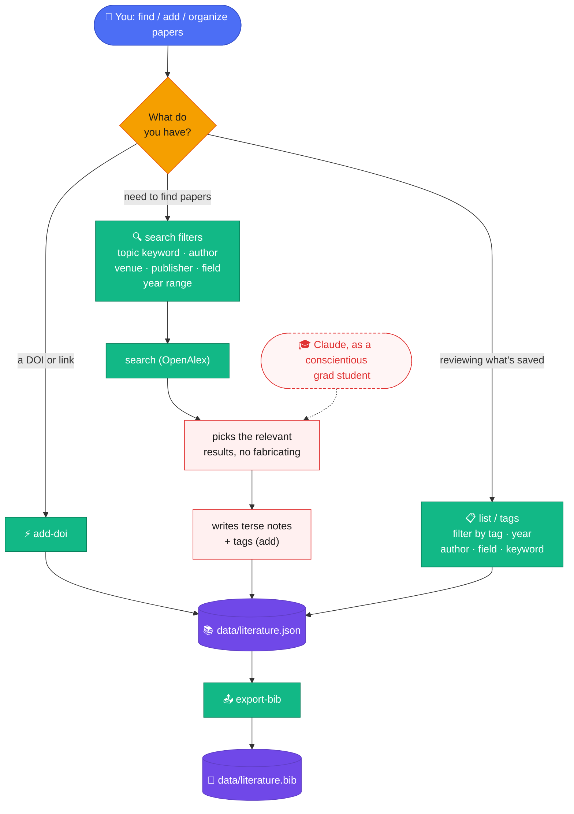

# literature-skill

<p align="center">
  <sub><a href="README.zh-TW.md">繁體中文</a></sub>
</p>

*Search a paper, decide it's relevant, file it, tag it, cite it — without ever hand-editing a .bib file.*

A Claude Code skill that turns literature management into a conversation: ask it to find papers, add the ones that matter to your catalog, filter by topic, and export citations. One JSON file is the single source of truth; BibTeX is always regenerated from it, never edited by hand.

## How it works

- **Search** — queries [OpenAlex](https://openalex.org/) by topic keyword, author, journal/venue, publisher, academic field, and/or publication year range; Claude picks what's actually relevant, you confirm before anything is saved.
- **Catalog** — each entry goes into `data/literature.json`, deduplicated by DOI (or title+year). Has a DOI already? `add-doi` fetches the authoritative record directly.
- **Tag** — Claude classifies by content on top of the field OpenAlex already assigns, no fixed taxonomy, reuses existing tags instead of inventing synonyms; a short relevance/technique note gets attached too (`annotate`, without retyping the record).
- **Filter** — by tag, year, author, field, or keyword (title, abstract, and notes), any combination. Search results flag ones you've already saved, and ones that look like a different DOI for something you already have (e.g. a preprint vs. its published version).
- **Export** — regenerates `data/literature.bib` from the catalog (optionally filtered), on demand.
- **Read** — for a paper with a legal open-access link, Claude can fetch and read the actual full text on request, to answer something the abstract can't, or to synthesize across several saved papers.



## Install

The bundled script only needs the Python standard library, but it runs inside a conda environment named `literature`; the skill creates it on first use if missing (`conda create -n literature python=3.11 -y`).

### Claude Code

```
/plugin marketplace add jacklin92/literature-skill
/plugin install literature@literature-skill
```

### Codex

```bash
codex plugin marketplace add jacklin92/literature-skill
codex
```

Open `/plugins`, select the `literature-skill` marketplace, and install `literature`.

## Usage

Just ask, in your own words: "find papers on X by author Y published after 2020", "add this one to my catalog", "what have I tagged as Z", "export the BibTeX for everything in field W". See [`skills/literature/SKILL.md`](skills/literature/SKILL.md) for exactly what Claude runs under the hood.

## Copyright and open access

The catalog always stores **bibliographic metadata** (title/authors/year/venue/publisher/field/DOI/URL — not copyrightable) and, when available, a short **abstract**. Beyond that, the line is legitimate access, not "metadata vs. full text":

- OpenAlex reports, for most works, whether a legal open-access copy exists and where — that **link** (`oa_url`) is stored on the entry, included in the exported BibTeX as a note, and Claude can read that specific page to summarize or synthesize the paper on request (no different from you opening it in a browser).
- No `oa_url`? The skill won't go looking for a way around that — no paywall scraping, no unofficial mirrors. If you already have legitimate access of your own (an institutional download, a PDF you paid for), hand Claude the text or file directly and it can read and summarize that too — that's you using access you already have.

## License

[MIT](LICENSE).
