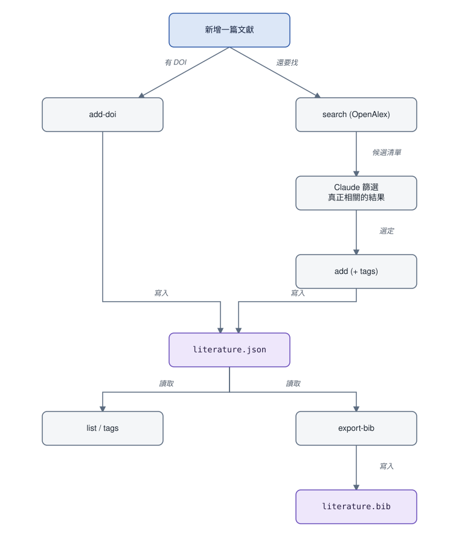

# literature-skill

<p align="center">
  <sub><a href="README.md">English</a></sub>
</p>

*搜尋一篇論文、判斷是否相關、建檔、貼標籤、引用——全程不用手動編輯 .bib 檔。*

一個 Claude Code skill,把文獻整理變成一段對話:請它找論文、把真正相關的收進你的目錄、依主題篩選、匯出引用。單一 JSON 檔是唯一事實來源;BibTeX 永遠由它重新產生,不手動編輯。

## 運作方式

- **搜尋** —— 依主題關鍵字、作者、期刊/會議名稱、出版社、學術領域、出版年份區間查 [OpenAlex](https://openalex.org/),由 Claude 判斷哪些真的相關,存進去之前你會先確認。
- **建檔** —— 每筆存進 `data/literature.json`,以 DOI(或標題+年份)去重。已經有 DOI 了?用 `add-doi` 直接抓權威記錄。
- **分類** —— OpenAlex 已經自動判斷學術領域,Claude 再依內容補上更細的標籤,沒有固定分類表,會重用既有標籤而不是自創同義詞。
- **篩選** —— 依標籤、年份、作者、領域或關鍵字,任意組合。
- **匯出** —— 隨時把目錄(可篩選)重新產生成 `data/literature.bib`。



*兩條新增文獻的路都寫進 `literature.json`;`list`/`tags` 跟 `export-bib` 都只從它讀取,不會反過來改它。*

## 安裝

腳本只需要 Python 標準庫,但是在名為 `literature` 的 conda 環境裡執行;沒有這個環境的話,skill 會在第一次使用時自動建立(`conda create -n literature python=3.11 -y`)。

### Claude Code

```
/plugin marketplace add jacklin92/literature-skill
/plugin install literature@literature-skill
```

### Codex

```bash
codex plugin marketplace add jacklin92/literature-skill
codex
```

打開 `/plugins`,選 `literature-skill` 這個 marketplace,安裝 `literature`。

## 使用方式

用你自己的話問就好:「幫我找 X 主題、Y 作者、2020 年以後的論文」、「把這篇加進我的文獻目錄」、「我標了 Z 的有哪些」、「把 W 領域的引用匯出成 BibTeX」。實際背後跑的指令細節在 [`skills/literature/SKILL.md`](skills/literature/SKILL.md)。

## 版權與開放存取

不論論文本身是否開放授權,目錄裡永遠只存**書目 metadata**(標題/作者/年份/期刊/出版社/領域/DOI/URL——這些不受著作權保護)以及有提供時的簡短**摘要**(跟 Google Scholar、PubMed 顯示給你的東西一樣)。這個工具**永遠不會下載全文或 PDF**,所以不管論文開不開放存取,都不會有版權問題——這條界線是刻意設計的,以後改功能也不該跨過去。

幾乎每篇文獻,OpenAlex 都會直接告訴我們有沒有合法開放存取版本、在哪裡——這個**連結**(`oa_url`)會存進條目,匯出 BibTeX 時也會附上。一樣只存連結,不會下載任何東西,也不需要額外註冊或申請金鑰。

## 授權

[MIT](LICENSE)。
