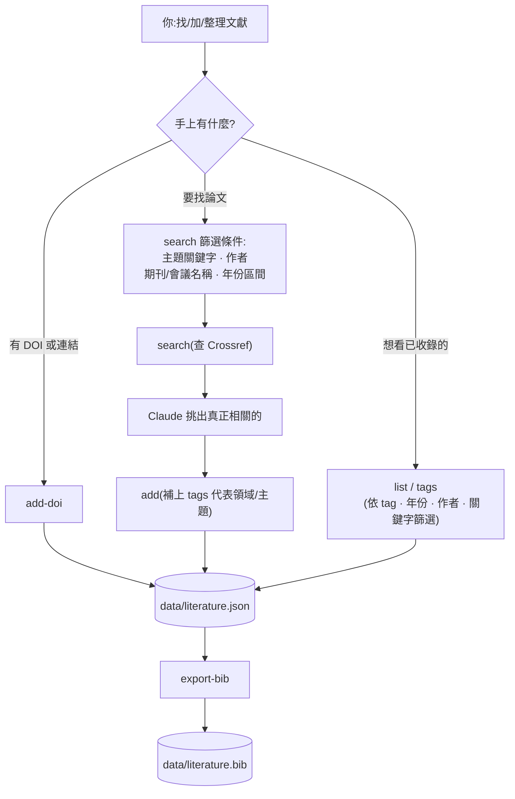

# literature-skill

<p align="center">
  <sub><a href="README.md">English</a></sub>
</p>

*搜尋一篇論文、判斷是否相關、建檔、貼標籤、引用——全程不用手動編輯 .bib 檔。*

一個 Claude Code skill,把文獻整理變成一段對話:請它找論文、把真正相關的收進你的目錄、依主題篩選、匯出引用。單一 JSON 檔是唯一事實來源;BibTeX 永遠由它重新產生,不手動編輯。

## 運作方式

- **搜尋** —— 依主題關鍵字、作者、期刊/會議名稱、出版年份區間查 Crossref,由 Claude 判斷哪些真的相關,存進去之前你會先確認。
- **建檔** —— 每筆存進 `data/literature.json`,以 DOI(或標題+年份)去重。已經有 DOI 了?用 `add-doi` 直接抓權威記錄。
- **分類** —— Claude 依內容判斷,沒有固定分類表,會重用既有標籤而不是自創同義詞。
- **篩選** —— 依標籤、年份、作者或關鍵字,任意組合。
- **匯出** —— 隨時把目錄(可篩選)重新產生成 `data/literature.bib`。



Crossref(搜尋的資料來源)沒有出版社篩選,也沒有領域/學科篩選,所以搜尋階段查不到這兩項;領域/學科的分組是之後在本地用 tags 做的。

## 安裝

腳本只需要 Python 標準庫,但是在名為 `literature` 的 conda 環境裡執行;沒有這個環境的話,skill 會在第一次使用時自動建立(`conda create -n literature python=3.11 -y`)。可以選擇性設定 `UNPAYWALL_EMAIL`(填你自己的聯絡信箱)來自動查詢合法開放存取連結(見下方說明)。

### Claude Code

```
/plugin marketplace add jacklin92/literature-skill
/plugin install literature@literature-skill
```

### Codex

```bash
codex plugin marketplace add jacklin92/literature-skill
codex
```

打開 `/plugins`,選 `literature-skill` 這個 marketplace,安裝 `literature`。

## 使用方式

用你自己的話問就好:「幫我找 X 主題的論文」、「把這篇加進我的文獻目錄」、「我標了 Y 的有哪些」、「把 Z 主題的引用匯出成 BibTeX」。實際背後跑的指令細節在 [`skills/literature/SKILL.md`](skills/literature/SKILL.md)。

## 版權與開放存取

不論論文本身是否開放授權,目錄裡永遠只存**書目 metadata**(標題/作者/年份/期刊/DOI/URL——這些不受著作權保護)以及 Crossref 有提供時的簡短**摘要**(跟 Google Scholar、PubMed 顯示給你的東西一樣)。這個工具**永遠不會下載全文或 PDF**,所以不管論文開不開放存取,都不會有版權問題——這條界線是刻意設計的,以後改功能也不該跨過去。

如果設定了 `UNPAYWALL_EMAIL`,新增文獻時會順便查 [Unpaywall](https://unpaywall.org/) 看有沒有合法開放存取版本的**連結**(best-effort,沒設或查詢失敗就靜靜跳過)——一樣只存連結,不會下載任何東西。

## 授權

[MIT](LICENSE)。
